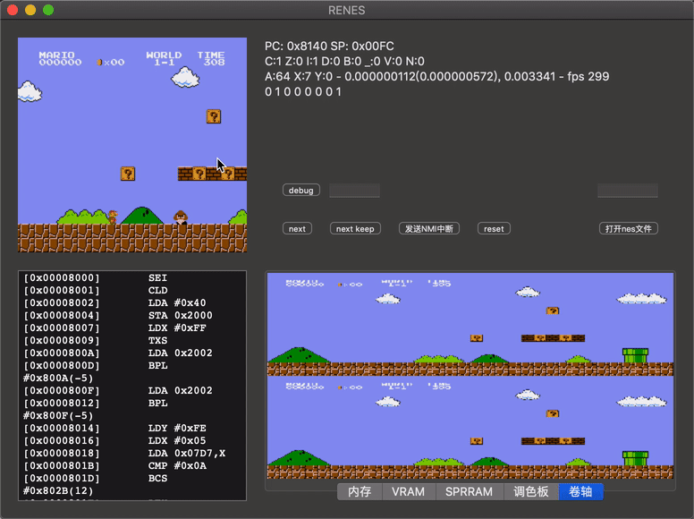

这是我用C++写的NES模拟器，没看过其他NES源码，边查资料边写的，不擅长C++，写得非常随意，以后有时间我还是打算用C重写。

目前只实现了Mapper0，可以运行的游戏:

* 超级玛丽
* 坦克大战（部分渲染不对）

暂时只针对Mac OS设计了界面，操作如下：

上下左右: WSAD

AB Select Start: JK12

效果图：

#### NESASM教程：

<http://blog.csdn.net/kkk584520/article/details/40375219>

#### NES DEV网站：

<http://nesdev.com/archive.html#NESPrograms>

#### 如何制作NES模拟器:

<http://chaofan.io/archives/%E5%A6%82%E4%BD%95%E5%88%B6%E4%BD%9Cnes%E6%A8%A1%E6%8B%9F%E5%99%A8>

#### 标准指令集：

<http://e-tradition.net/bytes/6502/6502_instruction_set.html>

#### 指令介绍：

<http://blog.sina.com.cn/s/blog_450c7f590100tn9u.html>

#### 指令中文介绍及实现：

<http://nesdev.com/6502_cn.txt>

修正及注意事项：

1、IF_DECIMAL模式的代码全部去掉（感觉实现有误，跑错，去掉不影响功能）

2、PLA没有操作A寄存器，需要增加一句：AC = src;

#### PPU相关:

2C02：<http://www.fceux.com/web/help/fceux.html?PPU.html>

PPU寄存器：<https://wiki.nesdev.com/w/index.php/PPU_registers>

调色板：<https://wiki.nesdev.com/w/index.php/PPU_palettes#Backdrop_color_.28palette_index_0.29_uses>

调色板镜像：<http://rebeldancer.blog.163.com/blog/static/2221911142013102392059724/>

镜像：<https://wiki.nesdev.com/w/index.php/Mirroring>

谈镜像：<http://wiki.nesdev.com/w/index.php/Talk:Mirroring>

滚动：<https://wiki.nesdev.com/w/index.php/PPU_scrolling>

硬件：<https://wiki.nesdev.com/w/index.php/Visual_2C02>

NES图形如何工作：<https://opcode-defined.quora.com/How-NES-Graphics-Work-Nametables>

碰撞检测原理：<https://retrocomputing.stackexchange.com/questions/1898/how-can-i-create-a-split-scroll-effect-in-an-nes-game>

#### CPU相关：

中断：<https://wiki.nesdev.com/w/index.php/CPU_interrupts>

内存映射：<https://wiki.nesdev.com/w/index.php/CPU_memory_map>

栈：<https://wiki.nesdev.com/w/index.php/Stack> （栈指针必须支持 [0,255] 的上下溢出）

状态标记：<https://wiki.nesdev.com/w/index.php/Status_flags>

B标记：<https://wiki.nesdev.com/w/index.php/CPU_status_flag_behavior> （未正常实现会造成SP指针的出入栈错误，造成中断返回错误）

IRQ：<https://wiki.nesdev.com/w/index.php/IRQ>

#### INES

<https://wiki.nesdev.com/w/index.php/INES>

#### HOW IT WORKS

<https://n3s.io/index.php?title=How_It_Works>

#### NES模拟器笔记

<https://ewind.us/2015/nes-emu-2-system-architure/>

#### 基于FPGA的NES游戏机系统

<https://www.amobbs.com/thread-4011489-1-1.html>